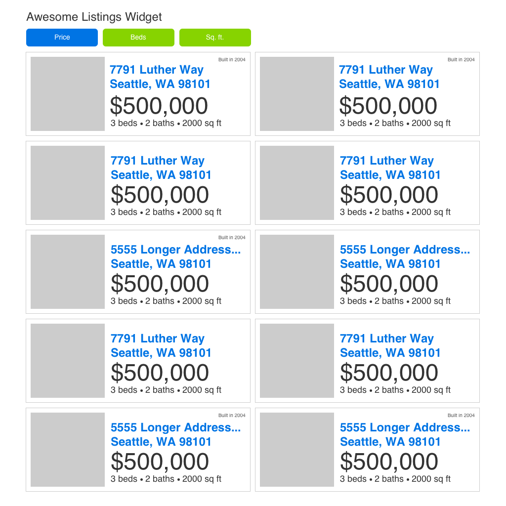

# Front End Coding Test

## Create a real estate property listing widget.

You will get data from two feed APIs - samples of this data can be found in `batmanRealty.json` and `supermanRealty.json`.  Using these sample files as a guide, please construct a widget that will correctly show these feeds.

Please note: data from actual feeds would follow the sample structures, and would have varying amounts of data ie. overlapping / missing values.

### Please adhere to the additional caveats:

*   The widget should reasonably resemble the included design and account for different screen sizes/devices.
*   The sort buttons are meant to be functional and should update the order of the properties when clicked. Note that only one of these buttons should be active at a time.
*   The widget should function in the latest versions of Microsoft Edge, Chrome and iOS/Android browsers.
*   Please use HTML, CSS and Javascript where applicable

Feel free to use any front end libraries/tools that you would like, but make sure that the final product (with viewable source code) can be viewed locally within a web browser.  Thank you and good luck!

Please do not publish or discuss solutions to this challenge online.

Bonus points for well tested code.

### Mockups

